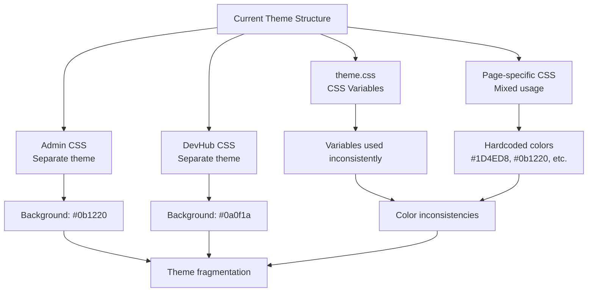
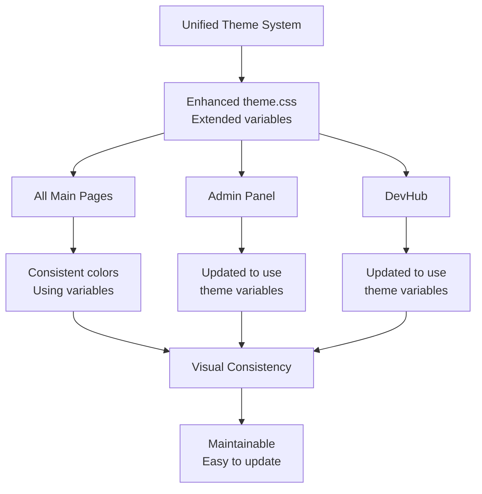
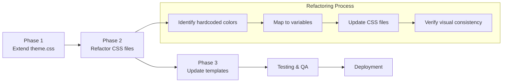

# Theme Upgrade - Visual Summary

## Current State Diagram

## Proposed Solution Architecture

## Color Standardization Map

| Component | Current Color | Proposed Variable |
|-----------|--------------|-------------------|
| Main Background | `#081120` | `--color-bg-main` |
| Admin Background | `#0b1220` | `--color-bg-admin` |
| DevHub Background | `#0a0f1a` | `--color-bg-devhub` |
| Card Background | `rgba(13, 27, 52, 0.92)` | `--color-bg-card` |
| Primary Blue | `#1D4ED8` | `--color-primary` |
| Gold Accent | `#D4AF37` | `--color-accent` |
| Beginner Level | `rgba(29, 78, 216, 0.16)` | `--color-level-beginner` |
| Card Border | `rgba(212, 175, 55, 0.14)` | `--color-border-card` |

## Implementation Workflow

## File Impact Assessment

**High Priority (Critical inconsistencies):**
- `dashboard.css` - User-facing, high traffic
- `projects.css` - Core functionality
- `admin.css` - Admin experience
- `devhub.css` - Developer experience

**Medium Priority (Visual improvements):**
- `blog.css` - Content pages
- `auth.css` - Authentication flows
- `profile.css` - User profiles

**Low Priority (Minor tweaks):**
- `footer.css` - Already good
- `header.css` - Already good
- `theme.css` - Foundation